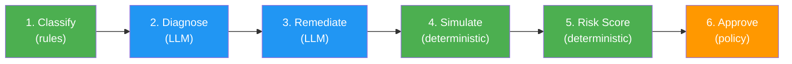
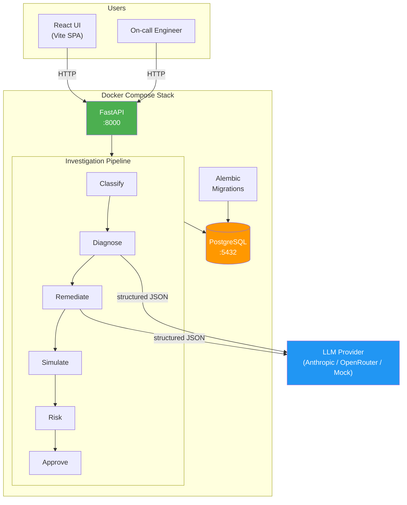
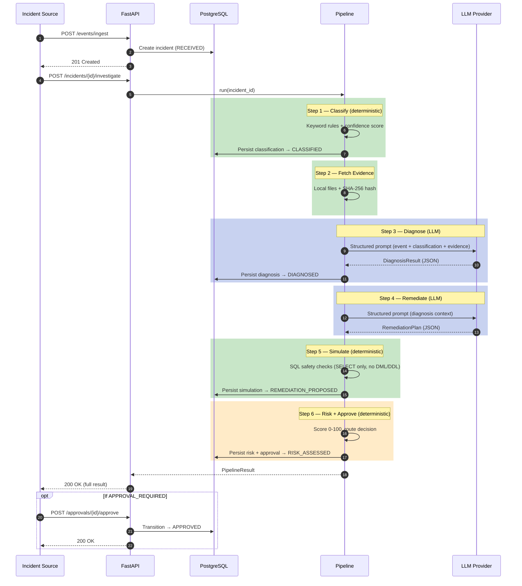
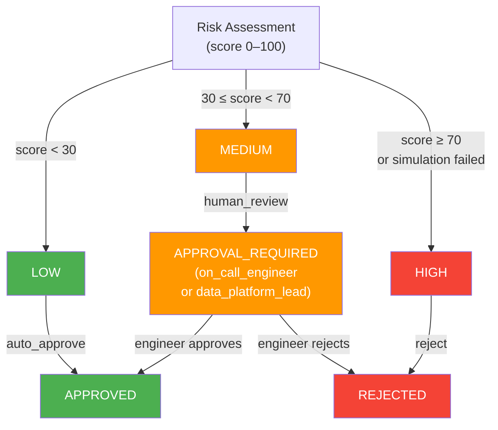
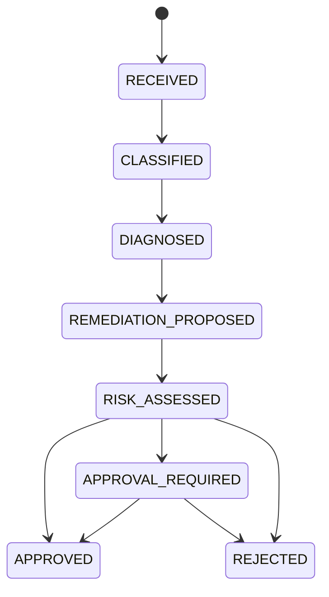

# Incident Investigator

An autonomous data incident investigation system that classifies, diagnoses, and proposes remediation for data pipeline failures — with deterministic safety gates, LLM-powered analysis, and human-in-the-loop approval.

Built with **Python 3.11+**, **FastAPI**, **SQLAlchemy**, **Pydantic v2**, and a **React** frontend.

---

## How It Works

When a data pipeline fails, Incident Investigator automatically runs a 6-step investigation pipeline:



> **Key principle:** LLMs propose, deterministic code validates and gates. No remediation is ever executed automatically — plans require human approval for production incidents.

---

## Architecture



---

## Sequence Diagram — Full Investigation Flow



---

## Approval Routing Logic



---

## State Machine

Every incident transitions through a strict, deterministic state machine. Only allowlisted `(from, to)` transitions are permitted — invalid transitions raise errors.



---

## Project Structure

```
├── main.py                     # Production entrypoint — wires all dependencies
├── src/investigator/
│   ├── api/                    # FastAPI routes (ingest, investigate, approvals, feedback)
│   ├── approval/               # Deterministic approval policy routing
│   ├── classification/         # Rules-based incident classifier
│   ├── config.py               # Pydantic Settings (env vars)
│   ├── db/                     # SQLAlchemy ORM models + session factory
│   ├── diagnosis/              # LLM-powered root-cause analysis engine
│   ├── evidence/               # Evidence provider (local files, SHA-256 hashing)
│   ├── llm/                    # LLM provider abstraction (Anthropic, OpenRouter, Mock)
│   ├── models/                 # Pydantic v2 data contracts (10 schemas)
│   ├── observability/          # Structured logging, metrics, SLO checker
│   ├── remediation/            # LLM planner + deterministic plan simulator
│   ├── reporting/              # Blameless postmortem generator
│   ├── repository/             # Incident repository (CRUD + state transitions)
│   ├── risk/                   # Deterministic 0-100 risk scoring engine
│   ├── state/                  # Incident status enum + state machine
│   └── workflow/               # Investigation pipeline orchestrator
├── ui/                         # React + Vite frontend (incident submission & tracking)
├── tests/                      # 526 unit tests + 23 integration tests
├── evidence/                   # Sample log files with real stack traces
├── alembic/                    # Database migrations
├── Dockerfile                  # Multi-stage build (non-root, slim)
├── docker-compose.yml          # Postgres + API stack
└── docs/                       # Architecture (C4), contracts, sequence diagrams
```

---

## API Endpoints

| Method | Endpoint | Description |
|--------|----------|-------------|
| `POST` | `/events/ingest` | Submit a pipeline failure event |
| `POST` | `/incidents/{id}/investigate` | Trigger the 6-step investigation pipeline |
| `GET` | `/incidents/{id}` | Get full incident record with all artefacts |
| `GET` | `/incidents` | List incidents (paginated, filterable by status) |
| `GET` | `/approvals/pending` | List incidents awaiting human approval |
| `POST` | `/approvals/{id}/approve` | Approve a remediation plan |
| `POST` | `/approvals/{id}/reject` | Reject a remediation plan |
| `POST` | `/incidents/{id}/feedback` | Submit outcome feedback (learning loop) |
| `GET` | `/metrics` | Prometheus-style metrics snapshot |
| `GET` | `/health` | Health check (DB ping + SLO evaluation) |

---

## Quick Start

### Development (no external dependencies)

```bash
# Clone and install
git clone https://github.com/holdersav20001/incident-investigator.git
cd incident-investigator
pip install -e ".[dev]"

# Run with SQLite + mock LLM (no API key needed)
python main.py
```

The API starts at `http://localhost:8000`. The mock LLM returns plausible stub responses so the full pipeline completes end-to-end.

### With Docker Compose (Postgres)

```bash
cp .env.example .env
# Edit .env with your LLM API key (optional)

docker compose up
```

### With a real LLM

```bash
# Anthropic
export LLM_PROVIDER=anthropic
export ANTHROPIC_API_KEY=sk-ant-...
python main.py

# OpenRouter
export LLM_PROVIDER=openrouter
export OPENROUTER_API_KEY=sk-or-...
python main.py
```

### React UI

```bash
cd ui
npm install
npm run dev
```

Opens at `http://localhost:5173` with a Vite proxy to the API.

---

## Running Tests

```bash
# Unit tests (526 tests, no Docker required)
pytest

# Integration tests (requires Docker)
pytest -m integration

# Full verification (compose + alembic + all tests)
pwsh scripts/verify.ps1
```

---

## Deterministic vs LLM Boundary

A core design principle — LLMs only handle unstructured reasoning. Everything else is deterministic:

| Component | Deterministic | LLM |
|-----------|:---:|:---:|
| State transitions | Yes | - |
| Schema/SQL validation | Yes | - |
| Approval policy | Yes | - |
| Classification | Yes (rules) | - |
| Risk scoring | Yes | - |
| **Diagnosis** | - | **Yes** |
| **Remediation planning** | - | **Yes** |

---

## Tech Stack

- **Backend:** Python 3.11+, FastAPI, Pydantic v2, SQLAlchemy 2.0, Alembic
- **Frontend:** React, Vite
- **Database:** PostgreSQL 16 (SQLite for development)
- **LLM:** Anthropic Claude / OpenRouter (pluggable provider abstraction)
- **Testing:** pytest (526 unit + 23 integration), testcontainers
- **CI:** GitHub Actions (test matrix + ruff lint)
- **Deployment:** Docker multi-stage build, docker-compose

---

## License

MIT
