# Incident Investigator — Sequence Diagram

```mermaid
sequenceDiagram
    actor User
    participant UI as React UI<br/>(localhost:5173)
    participant API as FastAPI<br/>(localhost:8000)
    participant DB as Postgres<br/>(incidents DB)
    participant Pipeline as InvestigationPipeline
    participant Classifier as RulesClassifier
    participant DiagEngine as DiagnosisEngine
    participant Planner as RemediationPlanner
    participant Simulator as PlanSimulator
    participant Risk as RiskEngine
    participant Policy as ApprovalPolicy
    participant LLM as OpenRouter LLM<br/>(gpt-oss-20b)

    %% ── Step 1: Submit event ──────────────────────────────────────────────
    User->>UI: Fill form & click<br/>"Run Investigation"
    UI->>API: POST /events/ingest<br/>{incident_id, source, environment,<br/>job_name, error_type, error_message}
    API->>DB: INSERT INTO incidents<br/>(status = RECEIVED)
    DB-->>API: OK
    API-->>UI: 201 {incident_id, status: "RECEIVED"}

    %% ── Step 2: Trigger investigation ────────────────────────────────────
    UI->>API: POST /incidents/{id}/investigate
    API->>Pipeline: pipeline.run(incident_id)
    Pipeline->>DB: get_incident(id)
    DB-->>Pipeline: IncidentRow

    %% ── Step 3: Classify ─────────────────────────────────────────────────
    rect rgb(30, 40, 70)
        Note over Pipeline,Classifier: Step 1 — Classification (rule-based, no LLM)
        Pipeline->>Classifier: classify(error_type, error_message)
        Classifier-->>Pipeline: ClassificationResult<br/>{type, confidence, reasoning}
        Pipeline->>DB: update_classification()<br/>record_transition(RECEIVED → CLASSIFIED)
    end

    %% ── Step 4: Diagnose ─────────────────────────────────────────────────
    rect rgb(40, 30, 70)
        Note over Pipeline,LLM: Step 2 — Diagnosis (LLM)
        Pipeline->>DiagEngine: diagnose(event, classification, evidence)
        DiagEngine->>LLM: POST /chat/completions<br/>{system: prompt + JSON schema,<br/>user: incident context}
        LLM-->>DiagEngine: JSON {root_cause, confidence,<br/>evidence, next_checks}
        DiagEngine-->>Pipeline: DiagnosisResult
        Pipeline->>DB: update_diagnosis()<br/>record_transition(CLASSIFIED → DIAGNOSED)
    end

    %% ── Step 5: Remediate ────────────────────────────────────────────────
    rect rgb(50, 35, 20)
        Note over Pipeline,LLM: Step 3 — Remediation Plan (LLM)
        Pipeline->>Planner: plan(event, classification, diagnosis)
        Planner->>LLM: POST /chat/completions<br/>{system: prompt + JSON schema,<br/>user: diagnosis context}
        LLM-->>Planner: JSON {plan[], rollback[],<br/>expected_time_minutes}
        Planner-->>Pipeline: RemediationPlan
        Pipeline->>DB: record_transition(DIAGNOSED → REMEDIATION_PROPOSED)
    end

    %% ── Step 6: Simulate ─────────────────────────────────────────────────
    rect rgb(40, 40, 20)
        Note over Pipeline,Simulator: Step 4 — Safety Simulation (deterministic)
        Pipeline->>Simulator: simulate(remediation_plan)
        Note right of Simulator: Checks each plan step for<br/>destructive SQL, unsafe ops
        Simulator-->>Pipeline: SimulationReport<br/>{ok, checks[], notes[]}
        Pipeline->>DB: update_remediation(plan, simulation)
    end

    %% ── Step 7: Risk ─────────────────────────────────────────────────────
    rect rgb(50, 25, 20)
        Note over Pipeline,Risk: Step 5 — Risk Assessment (deterministic)
        Pipeline->>Risk: assess(classification, diagnosis,<br/>plan, simulation, environment)
        Note right of Risk: Score 0–100 from weighted<br/>factors: env, confidence,<br/>sim result, error type
        Risk-->>Pipeline: RiskAssessment<br/>{score, level: LOW|MEDIUM|HIGH, factors}
        Pipeline->>DB: update_risk()<br/>record_transition(REMEDIATION_PROPOSED → RISK_ASSESSED)
    end

    %% ── Step 8: Approve ──────────────────────────────────────────────────
    rect rgb(20, 45, 30)
        Note over Pipeline,Policy: Step 6 — Approval Decision (policy)
        Pipeline->>Policy: decide(risk)
        Note right of Policy: LOW  → auto_approve<br/>MEDIUM → human_review<br/>HIGH + sim_fail → reject
        Policy-->>Pipeline: ApprovalDecision<br/>{outcome, required_role, reason}

        alt outcome = approved
            Pipeline->>DB: record_transition(RISK_ASSESSED → APPROVED)
        else outcome = rejected
            Pipeline->>DB: record_transition(RISK_ASSESSED → APPROVAL_REQUIRED → REJECTED)
        else outcome = human_review
            Pipeline->>DB: record_transition(RISK_ASSESSED → APPROVAL_REQUIRED)
            Pipeline->>DB: create_approval_queue_item(required_role)
        end
    end

    Pipeline-->>API: PipelineResult<br/>{incident_id, final_status, error?}
    API-->>UI: 200 {incident_id, final_status}

    %% ── Step 9: Fetch full details ───────────────────────────────────────
    UI->>API: GET /incidents/{id}
    API->>DB: get_incident(id)
    DB-->>API: IncidentRow<br/>{classification, diagnosis,<br/>remediation, simulation, risk,<br/>approval_status}
    API-->>UI: 200 IncidentResponse

    UI-->>User: Render pipeline steps:<br/>Classification → Diagnosis →<br/>Remediation → Simulation →<br/>Risk → Decision

    %% ── Optional: Human approval ─────────────────────────────────────────
    opt Incident is APPROVAL_REQUIRED
        User->>API: POST /approvals/{id}/approve<br/>{reviewer, note}
        API->>DB: record_approval_decision(approved=true)
        DB->>DB: record_transition(APPROVAL_REQUIRED → APPROVED)
        API-->>User: 200 {final_status: "APPROVED"}
    end
```



## Actors

| Actor | Role |
|-------|------|
| **React UI** | Form submission, pipeline result visualisation, history sidebar |
| **FastAPI** | HTTP API — ingest, investigate, approvals, feedback, metrics |
| **Postgres** | Persistent store for all incidents, transitions, approvals, feedback |
| **InvestigationPipeline** | Orchestrates the 6-step sequence; resumable from any intermediate state |
| **RulesClassifier** | Keyword-based error categorisation — no LLM, always fast |
| **DiagnosisEngine** | Builds a structured prompt and calls the LLM for root-cause analysis |
| **RemediationPlanner** | Calls the LLM to generate a concrete fix plan with rollback steps |
| **PlanSimulator** | Deterministic safety check — blocks destructive SQL or unsafe operations |
| **RiskEngine** | Scores 0–100 from weighted factors; determines LOW / MEDIUM / HIGH |
| **ApprovalPolicy** | Routes to auto-approve, human review queue, or auto-reject |
| **OpenRouter LLM** | `gpt-oss-20b:free` — only called for Diagnosis and Remediation |

## State machine

```
RECEIVED → CLASSIFIED → DIAGNOSED → REMEDIATION_PROPOSED → RISK_ASSESSED
                                                                    ↓
                                              APPROVED ← (LOW risk, safe plan)
                                              APPROVAL_REQUIRED ← (MEDIUM / human review)
                                              REJECTED ← (HIGH risk or unsafe plan)
```
